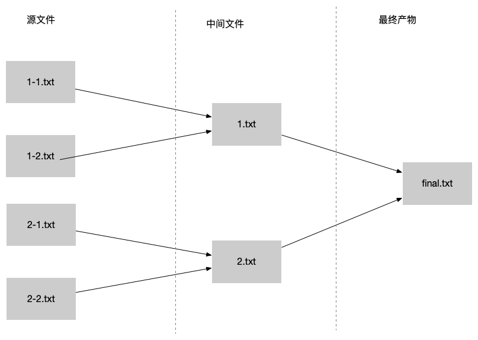
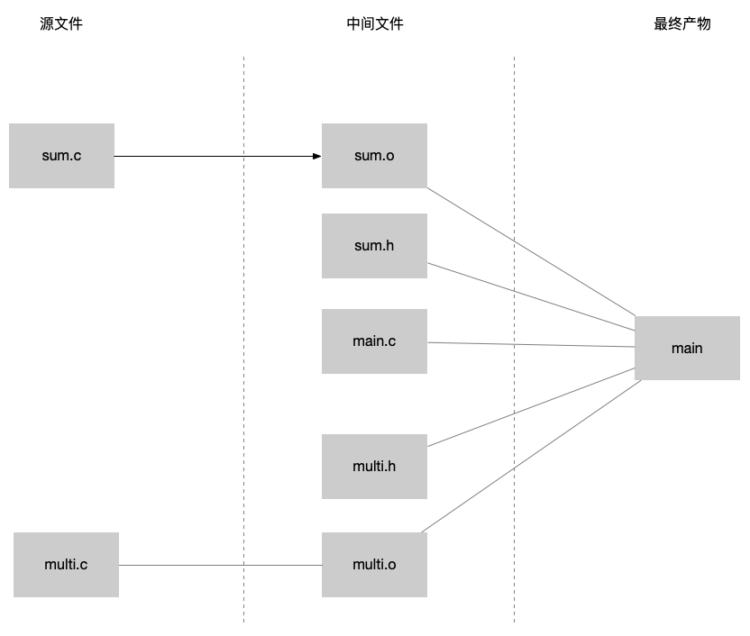

# makefile简介及使用

进阶必备，各大系统软件首选构建工具

c/c++必备构建工具,非常强大

基于文件依赖的自动化增量构建工具，类似于java中的maven,gradle但是更通用，没有语言限制，可使用任何系统可用命令

## 开源项目

linux(https://github.com/torvalds/linux)

redis(https://github.com/redis/redis) 学习安装目标 make install

mysql cmake(跨平台的生成makefile的构建工具)

......

## 示例

目标：按下图所示生成最终产物,按箭头所指包含关系合并子文件内容生成新的文件,并且要求依赖树上有更新只更新当前依赖路径即增量更新

现场实战演示全量构建,增量构建,clean伪目标

c项目实战

## brainfuck-c项目实战

目标:

编译并运行各版本的brainfuck解释器，演示变量和模式的使用

make run

资料：跟我一起写Makefile-重制版.pdf (文件在工程目录下)

# 自定义docker镜像之Dockerfile编写

## 目标

自定义Ubuntu镜像，使之满足可以编译c/c++程序并能进行远程调试

# gdb学习

## 目标

获取branfuck-jit生成的jit代码，并写出对应的makefile目标

参考 https://github.com/brainfusk/brainfuck-c

# clion远程调试运行在docker中的程序

## 为什么需要

解决在ide中本地debug非本机平台的代码

例如:在windows和mac上学习调试linux版jdk,redis,mysql